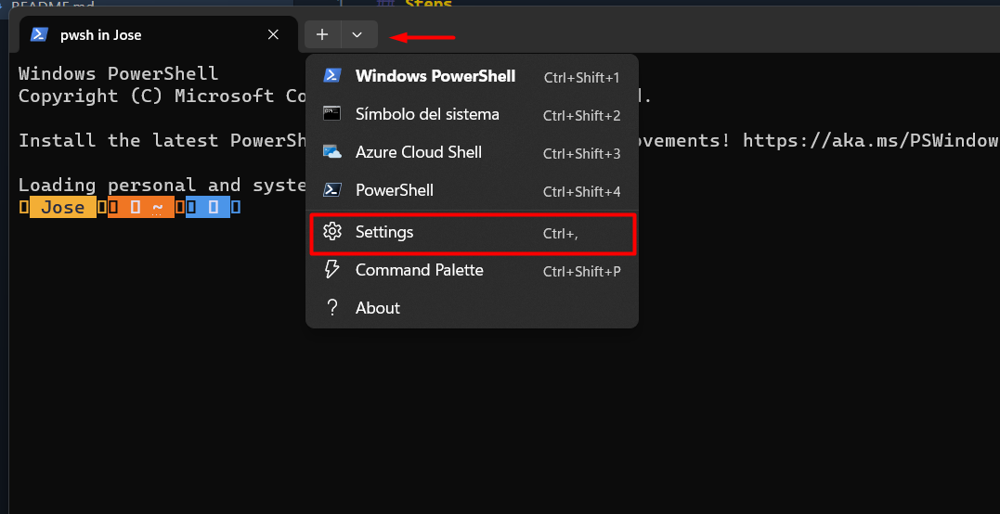
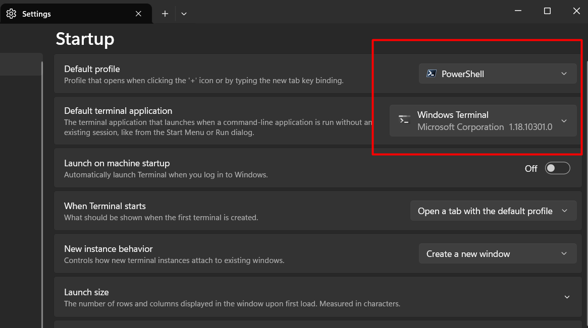
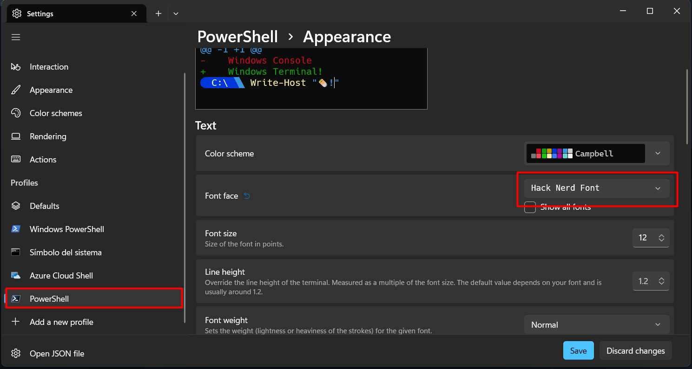

## Steps

1. Install Windows terminal in Microsoft store
2. Install PowerShell in Microsoft store
3. Install [Oh My Posh](https://ohmyposh.dev/docs/installation/windows) (Check that the terminal opens with the installed PowerShell)
4. [Change prompt](https://ohmyposh.dev/docs/installation/prompt)
5. Copy the content from \$PROFILE.txt into the env $PROFILE save and start new terminal
6. If an error show up, start a new terminal as administrator an use the follow command:

```bash
Set-ExecutionPolicy -Scope LocalMachine unrestricted
```

7. Download Hack Nerd Font form [here](https://www.nerdfonts.com/font-downloads) and install on windows
8. On terminal apply the following setting:



 9. On terminal settings selects Open JSON file and change the follow setting

```json
    "profiles":
    {
        "defaults":
        {
            "font":
            {
                "face": "Hack Nerd Font"
            }
        },
```
